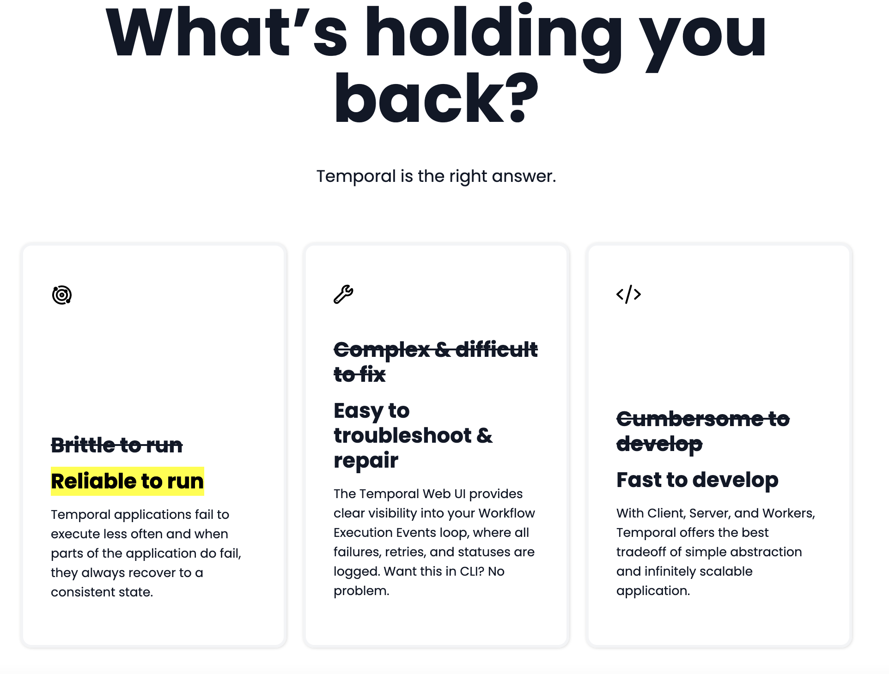

This is a [Next.js](https://nextjs.org/) project bootstrapped with [`create-next-app`](https://github.com/vercel/next.js/tree/canary/packages/create-next-app).

## Getting Started

First, run the development server:

```bash
npm run dev
# or
yarn dev
```

Open [http://localhost:3000](http://localhost:3000) with your browser to see the result.

You can start editing the page by modifying `pages/index.js`. The page auto-updates as you edit the file.

[API routes](https://nextjs.org/docs/api-routes/introduction) can be accessed on [http://localhost:3000/api/hello](http://localhost:3000/api/hello). This endpoint can be edited in `pages/api/hello.js`.

The `pages/api` directory is mapped to `/api/*`. Files in this directory are treated as [API routes](https://nextjs.org/docs/api-routes/introduction) instead of React pages.

## Learn More

To learn more about Next.js, take a look at the following resources:

- [Next.js Documentation](https://nextjs.org/docs) - learn about Next.js features and API.
- [Learn Next.js](https://nextjs.org/learn) - an interactive Next.js tutorial.

You can check out [the Next.js GitHub repository](https://github.com/vercel/next.js/) - your feedback and contributions are welcome!

## Deploy on Vercel

The easiest way to deploy your Next.js app is to use the [Vercel Platform](https://vercel.com/new?utm_medium=default-template&filter=next.js&utm_source=create-next-app&utm_campaign=create-next-app-readme) from the creators of Next.js.

Check out our [Next.js deployment documentation](https://nextjs.org/docs/deployment) for more details.


## Copy Update Docs

Currently, all page copy for each route is contained as string properties on each page:

- /home
- /use-cases
- /community

To update copy, find the copy in the component section you are concerned with, and make updates to the string copy.

### Example:

```javascript
  <FeatureCards
    cards = {[
      {
        icon: "/images/icons/spiral.svg",
        alt: 'orbital icon',
        super: "Brittle to run",
        headline: "Reliable to run", /*<- I want to change this card heading */
        subhead: "Temporal applications fail to execute less often and when parts of the application do fail, they always recover to a consistent state."
      }]
  />
```



## Enable Announcement Bar

To enable the announcement bar to be active on the site, locate the `GLOBAL_DATA` json object in `/pages/_app.js` file. Under the property `announcement.showAnnouncement` the value can be changed from true to false to show the announcement bar on the website. Once the user clicks the close button on the alert, the bar will be hidden for the rest of their session.

```
const GLOBAL_DATA = {
  announcement: {
    showAnnouncement: true, /* <- change value here */
    copy: 'Temporal raises $100 million Series B at a $1.5 billion valuation.',
    link: {
      href: '',
      copy: 'Read the article'
    }
  },
  nav: {
    icon: {
      src: '/images/logos/logo-temporal-with-copy.svg',
      alt: 'temporal logo',
      href: '/',
    },
  // ...
```